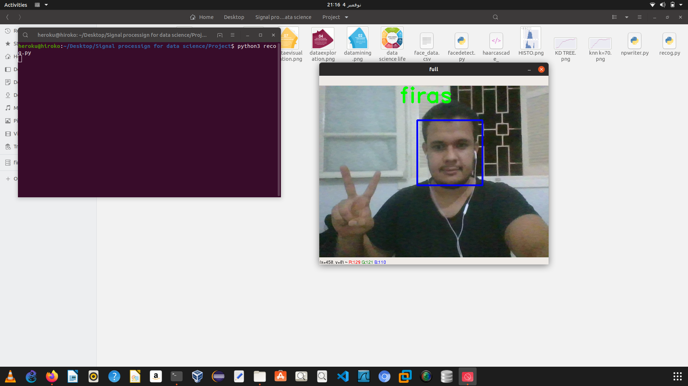

# Face-recognition-using-KNN
This project is realized as a part of a subject entitled Data Science for Signal Processing that i have studied during my final year at ENIT and supervised by my lovely teacher Mrs.MARRAKCHI Linda.

- The two first scripts(facedetect.py && npwriter.py) are used to identifiy faces using the haar cascad classifier and then write the face pixels into a csv file using the npwriter function, so we could use it for later time to train our model.

- The recog.py script is used to train the model and test it using live images captured from my webcam. 

- Face_Recognition_Signal_Processing_for_Data_Science_.ipynb jupyter notebook is used to test the performance and the accuracy our model for different values of K(the number of neighboores).

